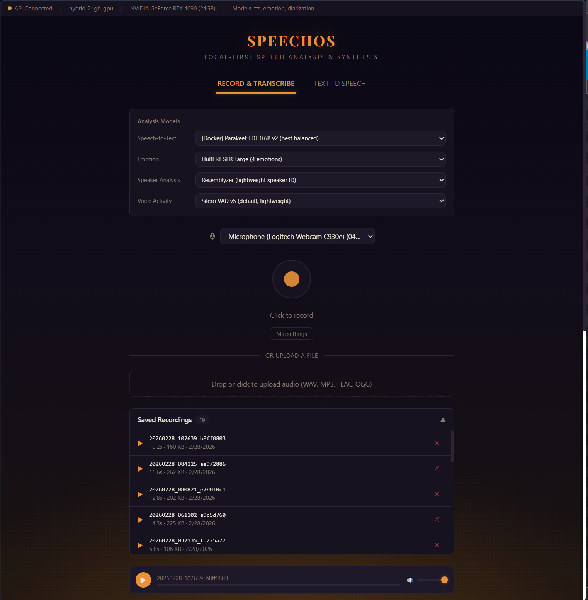
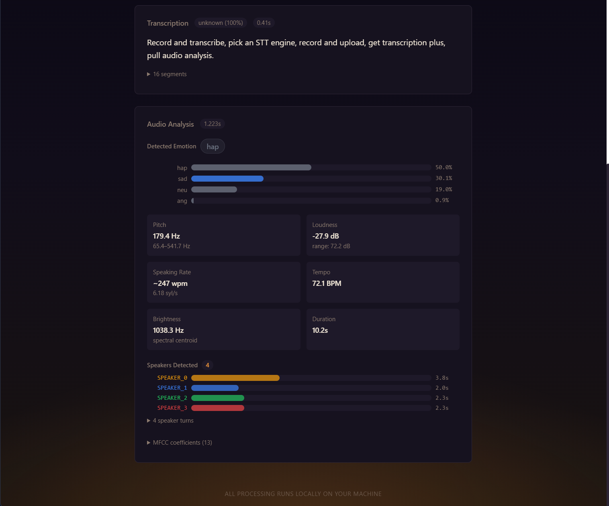

# Speechos

[](LICENSE)
[](https://python.org)
[](https://nextjs.org)
[](https://github.com/miikkij/Speechos/stargazers)

**A local benchmarking platform for speech AI models.**

There are dozens of speech-to-text, text-to-speech, and emotion recognition models out there: but which one actually works best for your hardware and use case? Speechos lets you quickly swap between engines, record or upload audio, and compare results side by side. Everything runs locally. No cloud APIs, no data leaves your machine.

Record speech, transcribe it with different STT engines, analyze emotion, detect speakers, synthesize speech with different TTS voices: and switch models with a dropdown to see how they compare.

<p align="center">
  
  
</p>
<p align="center">
  <em>Record & Transcribe: pick an STT engine, record or upload, get transcription + full audio analysis</em>
</p>

<p align="center">
  
</p>
<p align="center">
  <em>Text to Speech: switch engines, type text, hear the result instantly</em>
</p>

---

## Quick Start

You need Python (for the AI models) and Node.js (for the web UI). The dev script starts everything together.

### Prerequisites

- [**uv**](https://docs.astral.sh/uv/getting-started/installation/) (Python package manager)
- **Node.js** 22+ and **pnpm** (`npm install -g pnpm`)
- **FFmpeg** (optional, for non-WAV audio)

### Install & Run

```bash
git clone https://github.com/miikkij/Speechos.git
cd Speechos

# Install everything
cd api && uv sync && cd ..
cd web && pnpm install && cd ..

# Start (Linux / Mac / WSL2)
./dev.sh

# Start (native Windows without WSL)
.\dev.ps1
```

Open [http://localhost:36301](http://localhost:36301) and you're in.

> **WSL2 users**: use `./dev.sh`, not the PowerShell script. You're running Linux.

### First Run

AI models download automatically the first time you use each feature. Whisper Tiny is ~75 MB and takes seconds; Whisper Large v3 is ~3 GB and takes a minute. After that, they're cached in `models/`.

## What It Does

### Record & Compare STT

Click the mic, speak, click again. Your audio gets transcribed, analyzed for emotion, and checked for multiple speakers: all at once. Switch the STT engine from the dropdown (Whisper tiny through large-v3, Vosk, Wav2Vec2, or Docker engines) and re-process the same recording to compare accuracy.

You can also drag-and-drop audio files (WAV, MP3, FLAC, OGG).

### Compare TTS Engines

Switch to the TTS tab, pick an engine, type text, hit Speak. Switch to another engine and try the same text. Each engine handles emotion differently: the **Markup guide** shows what syntax each one supports, with clickable examples you can try instantly:

| Engine | How it handles emotion |
|--------|----------------------|
| Qwen3-TTS | Just write expressively: "I'm so excited!" |
| ChatTTS | Token tags: `[laugh_0]`, `[break_3]`, `[oral_2]` |
| Orpheus | XML: `<laugh>ha ha</laugh>`, `<sigh>`, `<gasp>` |
| Parler | Describe the voice: "A calm, slow female voice" |
| Bark | `ALL CAPS` for emphasis, `...` for pauses |
| Piper / Kokoro / eSpeak | No markup: pick a voice and go |

### Emotion & Speaker Analysis

Every recording automatically gets:
- **Emotion scores**: happy, angry, sad, neutral, etc. with confidence bars
- **Speaker diarization**: who spoke when, how long each person talked
- **Audio features**: pitch, loudness, speaking rate, tempo, spectral analysis, MFCCs

## How It Works

Speechos is a web app with a Python backend. The browser handles recording and playback; Python handles all the AI work (model loading, inference, audio processing). They talk over a REST API.

```
Browser (:36301)              Python API (:36300)           Docker Engines
┌──────────────┐              ┌──────────────────┐          ┌──────────────┐
│  Record mic  │──────────→   │  Transcribe      │          │  STT (7)     │
│  Play audio  │←─────────    │  Synthesize      │───────→  │  TTS (8)     │
│  Switch model│──────────→   │  Analyze         │          │  Analysis (2)│
│  Show results│              │  Manage models   │          └──────────────┘
└──────────────┘              └──────────────────┘
```

The dev script (`./dev.sh`) starts both processes and shuts them down cleanly on Ctrl+C. That's it.

## Supported Engines

### Built-in (no Docker needed)

| Category | Engine | Notes |
|----------|--------|-------|
| **STT** | faster-whisper (tiny → large-v3) | Best all-around, GPU recommended for large |
| **STT** | Vosk | Lightweight, CPU-only, real-time |
| **STT** | Wav2Vec2 | Facebook's model, CPU friendly |
| **TTS** | Piper | Fast, CPU, 7 voices |
| **TTS** | Kokoro | Best quality/size ratio |
| **TTS** | eSpeak | Instant, robotic, 100+ languages |
| **TTS** | Bark | Music/effects, slow, needs GPU |
| **TTS** | Chatterbox | Voice cloning, MIT licensed |
| **Emotion** | emotion2vec+ | Best accuracy (FunASR) |
| **Emotion** | HuBERT SER | 7-8 emotion classes |
| **Diarization** | Resemblyzer | Lightweight speaker ID |
| **VAD** | Silero v5 | Voice activity detection |

### Docker Engines (optional, for more options)

Run additional engines as isolated containers. They share the GPU, so start one at a time per category.

```bash
# Start an engine
docker compose -f docker/tts-engines.yml up -d xtts

# Stop it (frees GPU)
docker compose -f docker/tts-engines.yml stop xtts
```

**TTS**: XTTS, ChatTTS, MeloTTS, Orpheus, Fish-Speech, Qwen3-TTS, Parler
**STT**: Speaches, Whisper-ASR, LinTO NeMo, LinTO Whisper
**Analysis**: PyAnnote (diarization), FunASR (emotion)

Some Docker engines need a HuggingFace token:
```bash
cp .env.example .env
# Edit .env and set HF_TOKEN=hf_your_token
```

## Hardware

The system auto-detects your GPU/CPU/RAM and picks appropriate models. You can override:

```bash
SPEECHOS_TIER=gpu-24gb ./dev.sh
```

| Tier | What you get |
|------|-------------|
| `cpu-2gb` | Whisper Tiny + Piper (minimum) |
| `cpu-8gb` | Whisper Small + Piper + Kokoro |
| `gpu-8gb` | Whisper Medium + Kokoro |
| `gpu-12gb` | Whisper Large v3 + Kokoro |
| `gpu-24gb` | Everything + Docker engines |

See `docs/architecture/HARDWARE-TIERS.md` for the full matrix.

## Docker Deployment

For running the whole stack in containers (not needed for development):

```bash
# GPU
docker compose -f docker/docker-compose.gpu.yml up --build

# CPU-only
docker compose -f docker/docker-compose.cpu.yml up --build

# Or auto-detect
./start.sh
```

## Port Allocation

```
36300        API (Python/FastAPI)
36301        Web UI (Next.js)
36310-36317  TTS Docker engines
36320-36327  STT Docker engines
36330-36331  Analysis Docker engines
```

## Project Structure

```
Speechos/
├── api/                    Python backend: AI models, audio processing, REST API
│   ├── src/                FastAPI server, model manager, engine adapters, audio pipeline
│   │   ├── server.py       Main FastAPI app and WebSocket handler
│   │   ├── models.py       Model loading, switching, and hardware detection
│   │   ├── config.py       Hardware tier system and auto-configuration
│   │   ├── audio.py        Audio decoding, resampling, format conversion
│   │   └── routers/        API endpoints (transcribe, synthesize, analyze, recordings)
│   └── test_*.py           Test suites (30 tests across 6 files)
├── web/                    Browser frontend: recording, playback, UI
│   └── src/
│       ├── app/            Next.js pages, layout, global styles
│       ├── components/     Recorder, TTS playground, audio player, analysis view
│       └── lib/            API client, localStorage persistence
├── docker/                 Dockerfiles and compose configs for all engines
│   ├── tts-engines.yml     8 TTS engine containers (ports 36310-36317)
│   ├── stt-engines.yml     STT engine containers (ports 36320-36327)
│   └── analysis-engines.yml  Analysis containers (ports 36330-36331)
├── docs/                   Architecture docs, model research, engine audit
├── samples/                Sample WAV files for testing
├── config.example.yaml     Configuration template with all options documented
├── dev.sh / dev.ps1        Dev launcher: starts API + Web, cleans up on Ctrl+C
└── start.sh / start.ps1    Production launcher: auto-detects GPU, runs via Docker
```

## Development

```bash
./dev.sh                # Start everything
./dev.sh --api          # API only
./dev.sh --web          # Web only

cd api && uv run pytest # Run tests
cd web && pnpm build    # Production build
```

## Configuration

Copy `config.example.yaml` to `config.yaml` to override defaults:

```yaml
compute_mode: auto          # auto | cpu | gpu | hybrid
tier: auto                  # auto | cpu-8gb | gpu-12gb | ...
model_loading: lazy         # lazy | eager

stt:
  engine: faster-whisper
  model: large-v3

tts:
  engine: kokoro
  model: default
```

## API

Interactive docs at [http://localhost:36300/docs](http://localhost:36300/docs) (Swagger UI).

| Method | Path | What it does |
|--------|------|-------------|
| `POST` | `/api/transcribe` | Upload audio, get transcription |
| `POST` | `/api/synthesize` | Send text, get audio back |
| `POST` | `/api/analyze` | Upload audio, get emotion + features + speakers |
| `GET/POST/DELETE` | `/api/recordings` | Manage saved recordings |
| `GET` | `/api/system/model-options` | Available engines and current selections |
| `POST` | `/api/system/switch-model` | Switch engine for a category |

## License

[MIT](LICENSE)
